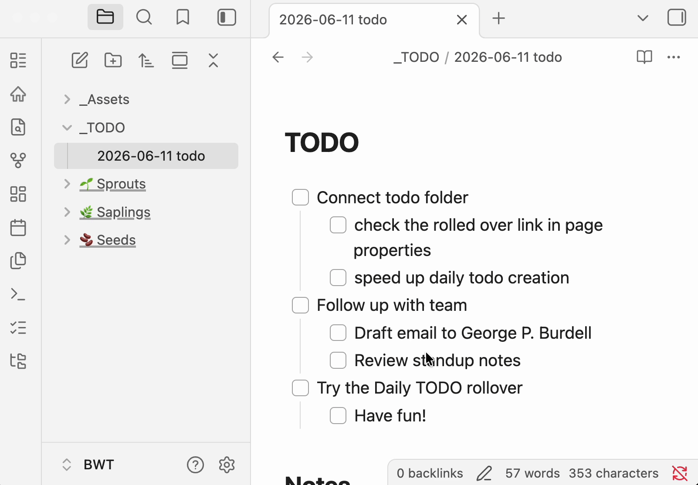

# Daily TODO

A **standalone** [Obsidian](https://obsidian.md) community plugin for a dedicated daily TODO workflow. Create dated TODO files in their own folder — separate from journal or daily notes — and roll incomplete tasks forward with one click. No Daily Notes or Periodic Notes plugin required.



## Features

- **Standalone workflow** — Does not require the Daily Notes or Periodic Notes plugins.
- **One-click creation** — Ribbon icon or command palette creates today's TODO file; not a hook on daily note creation.
- **Dedicated TODO folder** — Dated files like `2025-06-09 TODO.md`, stored separately from journal or daily notes.
- **TODO-section scoped** — Only rolls incomplete items from the `# TODO` section; stops at `## Notes` or other headings.
- **Smart nested rollover** — Preserves nested content under incomplete tasks; skips completed checkbox subtrees.
- **First-run setup** — Modal to browse an existing folder or create `_TODO` with a sample yesterday file for immediate testing.
- **Frontmatter metadata** — `tags`, `date`, `type: daily-todo`, and `rolledOverFrom` wikilink to the source note.
- **Folder recovery** — Re-prompts setup if the configured folder is deleted or moved.
- **Automatic source detection** — Finds the most recent dated TODO file before today in your configured folder (including subfolders).
- **Configurable naming** — Set the vault folder, file name suffix, frontmatter tag, and whether to include a `# TODO` heading.
- **Legacy file support** — Automatically renames older files that used `YYYY-MM-DDtodo.md` naming to the current `YYYY-MM-DD TODO.md` format.

## Installation

### From Obsidian Community Plugins

1. Open **Settings → Community plugins**.
2. Turn off **Restricted mode** if needed.
3. Click **Browse**, search for **Daily TODO**, and install.
4. Enable the plugin.

### Manual installation

1. Download `main.js` and `manifest.json` from the [latest GitHub release](https://github.com/aaronarcade/Obsidian-Daily-Todo/releases).
2. Create a folder `{vault}/.obsidian/plugins/dailytodo/`.
3. Copy `main.js` and `manifest.json` into that folder.
4. Reload Obsidian and enable **Daily TODO** under **Settings → Community plugins**.

## Usage

### First run

The first time you use the plugin (or if your configured folder no longer exists), a setup modal appears when you run **Create today's TODO**:

1. **Browse folders** — Pick an existing vault folder for daily TODO notes.
2. **Create `_TODO`** — Creates a `_TODO` folder with a sample yesterday note so you can test rollover immediately.

After setup, today's TODO file is created automatically.

### Daily workflow

1. Configure the plugin under **Settings → Daily TODO settings** (optional — first-run setup handles the basics):
   - **TODO folder** — Where daily TODO files are stored (default after setup: `_TODO`).
   - **File name suffix** — Appended after the date (default: `TODO`, producing `2025-06-09 TODO.md`).
   - **TODO tag** — Frontmatter tag added to new notes (default: `todo`).
   - **Include heading** — Whether to add a `# TODO` heading below the frontmatter.
2. Create today's note using either:
   - The **list-checks** ribbon icon (**Create today's TODO**), or
   - **Command palette → Create today's TODO from previous day**.
3. If today's file already exists, the plugin opens it instead of creating a duplicate.

### Example output

Given incomplete tasks in `TODO/2025-06-08 TODO.md`, running the command on June 9 creates `TODO/2025-06-09 TODO.md`:

```markdown
---
tags: [daily, todo]
date: 2025-06-09
type: daily-todo
rolledOverFrom: "[[2025-06-08 TODO]]"
---

# TODO

- [ ] Finish report
  - [ ] Gather sources
- [ ] Email team

## Notes

```

The sample yesterday file created during first-run setup demonstrates nested rollover: completed sub-tasks (e.g. `- [x] Draft email…`) are left behind; incomplete siblings roll forward.

### File naming

Daily TODO files must start with a date in `YYYY-MM-DD` format:

| Suffix setting | Example file name    |
| -------------- | -------------------- |
| `TODO`         | `2025-06-09 TODO.md` |
| *(empty)*      | `2025-06-09.md`      |
| `todo`         | `2025-06-09 todo.md` |

### Note structure

For best results, structure each daily TODO file like this:

```markdown
# TODO

- [ ] Your tasks here

## Notes

Free-form notes that are never rolled over.
```

Only content between `# TODO` and `## Notes` (or the next top-level heading) is considered for rollover.

## Development

```bash
git clone https://github.com/aaronarcade/Obsidian-Daily-Todo.git
cd Obsidian-Daily-Todo
npm install
npm run dev
```

Symlink or copy the plugin folder into your vault's `.obsidian/plugins/` directory. Use `npm run dev` for watch mode during development.

Build for production:

```bash
npm run build
```

## License

MIT — see [LICENSE](LICENSE).
